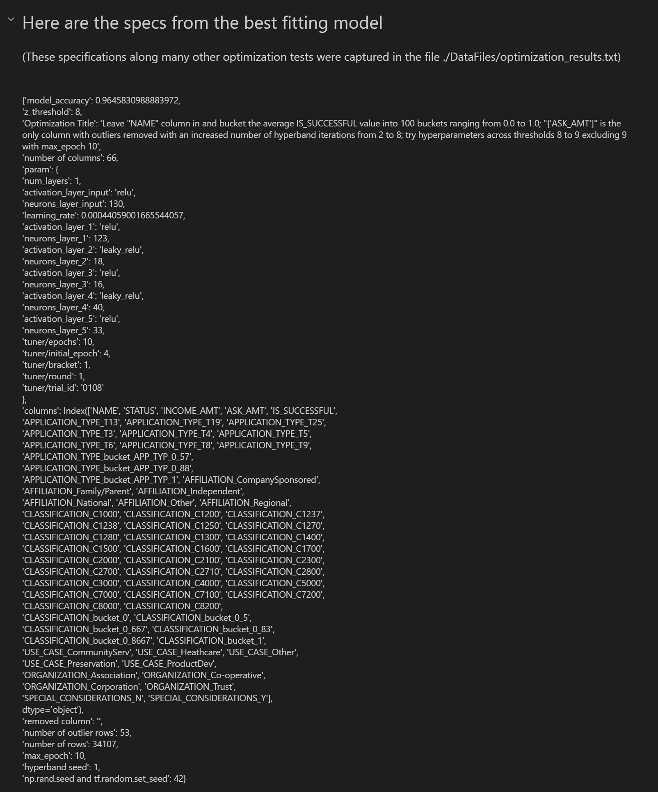
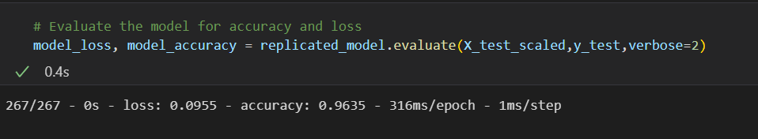
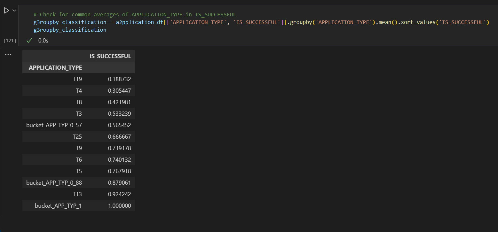

# deep-learning-challenge

#### By Karoly Burgyan

# Sources
<ol>
  <li>Dataset provided by IRS. Tax Exempt Organization Search Bulk Data Downloads. https://www.irs.gov/Links to an external site.</li>
  <li>ChatGPT https://chat.openai.com/</li>
</ol>

# Overview
This project was tasked with being able to predict, with the highest accuracy possible, which ventures would have the 'best chance of success' if given funding by the nonprofit foundation Alphabet Soup.  
Deep Learning and neural networks were used to create a prediction model that maximized accuracy in predicting for 'best chance of success'.

# Results

## Data Preprocessing
<ul>
<li>What variable(s) are the target(s) for your model?</li>The target for the model was:
<ul>
<li>IS_SUCCESSFUL—'Was the money used effectively'</li>
</ul>
<li>What variable(s) are the features for your model?</li>
The features for the model were:
<ul>
<li>APPLICATION_TYPE—'Alphabet Soup application type'</li>
<li>AFFILIATION—'Affiliated sector of industry'</li>
<li>CLASSIFICATION—'Government organization classification'</li>
<li>USE_CASE—'Use case for funding'</li>
<li>ORGANIZATION—'Organization type'</li>
<li>STATUS—'Active status'</li>
<li>INCOME_AMT—'Income classification'</li>
<li>SPECIAL_CONSIDERATIONS—'Special considerations for application'</li>
<li>ASK_AMT—'Funding amount requested'</li>
</ul>
<li>What variable(s) should be removed from the input data because they are neither targets nor features?</li>
<ul>
<li>EIN—'Identification column'</li>
<li>NAME—'Identification column'</li>
</ul>
</ul>

## Compiling, Training, and Evaluating the Model

<ul>
<li>How many neurons, layers, and activation functions did you select for your neural network model, and why?</li>
With the help of keras_tuner.Hyperband, the model chosen was the model that it found to have the highest accuracy when varying the number of layers, neurons, and activation functions.  The specs for the model chosen were as follows:
<ul>
<li>number of layers (excluding the output layer) -- 6</li>
<li>number of neurons in each layer (starting from the input layer)-- 74, 50, 28, 17, 48, 411</li>
<li>activation function for each layer (starting from the input layer (excluding the output layer which used sigmoid)) -- 'tanh', 'leaky_relu', 'leaky_relu', 'relu', 'relu', 'leaky_relu'</li>
<li>learning rate -- 0.00053</li>
<li>optimizer -- 'adam'</li>
<li>output activation function -- 'sigmoid'</li>
<li>outlier limit -- 8 z-score threshold</li>
<li>buckets -- 9 buckets</li>
     
</ul> 
<li>Were you able to achieve the target model performance?</li>
No, the model had an accuracy of 74.09% which is just 0.9% short of 75%.
      
<li>What steps did you take in your attempts to increase model performance?</li>
<ul>
    <li>epochs -- the number of epochs were varied from 1 to 100</li>
    <li>layers -- (including input layer but excluding output layer) were varied from 1 to 11</li>
    <li>neurons per layer -- were varied from 2 to 2 X the number of features</li>
    <li>number of features -- were varied from 43 to 116</li>
    <li>activation functions -- were varied between 'relu', 'leaky_relu', and 'tanh' (for all layers except output layer which used 'sigmoid')</li>
    <li>bucket size -- varied the number of values that would be converted into 'other' from 0 to 63</li>
    <li>number of bucket -- varied from 0 to 9 (6 buckets for CLASSIFICATOIN and 3 for APPLICATION_TYPE)</li>
    
     
    <li>removed outliers -- varied from a z-score limit of 1 to 352</li>
    <li>learning rate -- varied from 0.0001 to 0.01 for an 'adam' optimizer</li>

</ul>
</ul>

1 Doesn't include the 1 neuron in the output layer.

2 Note that these variations provide the backbone of a massive amount of potential permutations if the variations were done simultaneously and exhaustively. However, this task would take far more time and resources than is currently available.

# Summary

The model that was found had an accuracy of 74.09% which was short of the 75% accuracy by only 0.9%. This model had 6 layers, a total of 258 neurons across the 6 layers1, and 4 different activation functions 'tanh', 'relu', 'leaky_relu', and 'sigmoid'. It was tested on an initial dataset with over 34,000 datapoints. It would be fairly helpful in predicting successful ventures for the Alphabet Soup Charity to invest in.

1 Doesn't include the 1 neuron in the output layer. (repeated from above)

## Alternative Solution

An alternative model with more accuracy could possibly be found with more accuracy if more time and funding were available to vary the different parameters simultaneously. This would require vastly more processing power and energy if taken to the limit of trying every configuration simultaneously that was tried individually.